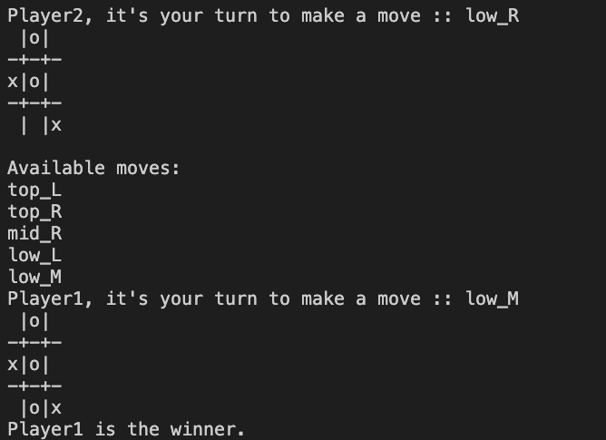

# Read Me Template





---

### Table of Contents
You're sections headers will be used to reference location of destination.

- [Description](#description)
- [How To Use](#how-to-use)
- [References](#references)
- [License](#license)
- [Author Info](#author-info)

---

## Description
This is a 2-player TUI tic-tac-toe game created with Python. The game prints out the tic-tac-toe grid to the terminal and then the possible available moves to the screen for the players to choose from. The grid positions are filled with, X's and O's, and updated on the screen as the players make moves.

#### Technologies

- Object oriented programming
- Dictionaries

[Back To The Top](#read-me-template)

---

## How To Use
- Run ```html <p>python tictactoe.py</p>```
- Players should take turns making moves by entering the grid locations.

#### Installation
- This game requires only the [installation of Python3](https://www.python.org/downloads/)

---

## License

MIT License

Copyright (c) 2021 [yawok](https://github.com/yawok)

Permission is hereby granted, free of charge, to any person obtaining a copy
of this software and associated documentation files (the "Software"), to deal
in the Software without restriction, including without limitation the rights
to use, copy, modify, merge, publish, distribute, sublicense, and/or sell
copies of the Software, and to permit persons to whom the Software is
furnished to do so, subject to the following conditions:

The above copyright notice and this permission notice shall be included in all
copies or substantial portions of the Software.

THE SOFTWARE IS PROVIDED "AS IS", WITHOUT WARRANTY OF ANY KIND, EXPRESS OR
IMPLIED, INCLUDING BUT NOT LIMITED TO THE WARRANTIES OF MERCHANTABILITY,
FITNESS FOR A PARTICULAR PURPOSE AND NONINFRINGEMENT. IN NO EVENT SHALL THE
AUTHORS OR COPYRIGHT HOLDERS BE LIABLE FOR ANY CLAIM, DAMAGES OR OTHER
LIABILITY, WHETHER IN AN ACTION OF CONTRACT, TORT OR OTHERWISE, ARISING FROM,
OUT OF OR IN CONNECTION WITH THE SOFTWARE OR THE USE OR OTHER DEALINGS IN THE
SOFTWARE.

[Back To The Top](#read-me-template)

---

## Author Info

- Twitter - [@obengky](https://twitter.com/obengky)

[Back To The Top](#read-me-template)
